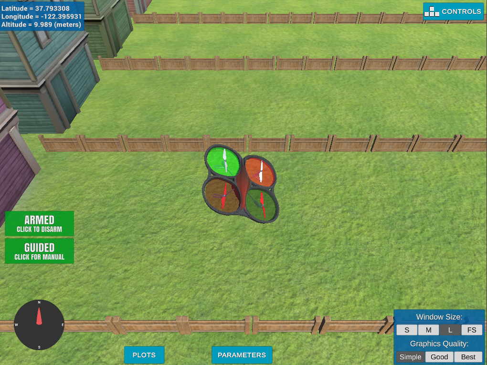

# AAE_001_BackyardFlyer
Project 001 of Udacity's Autonomous Aerial Engineer ("Flying Car") Nanodegree, "Backyard Flyer".

This project was a basic introduction to the Udacidrone simulator, programming the quadrotor as a state machine, and creating waypoints for your quadrotor to follow -- as seen in backyard_flyer.py.

